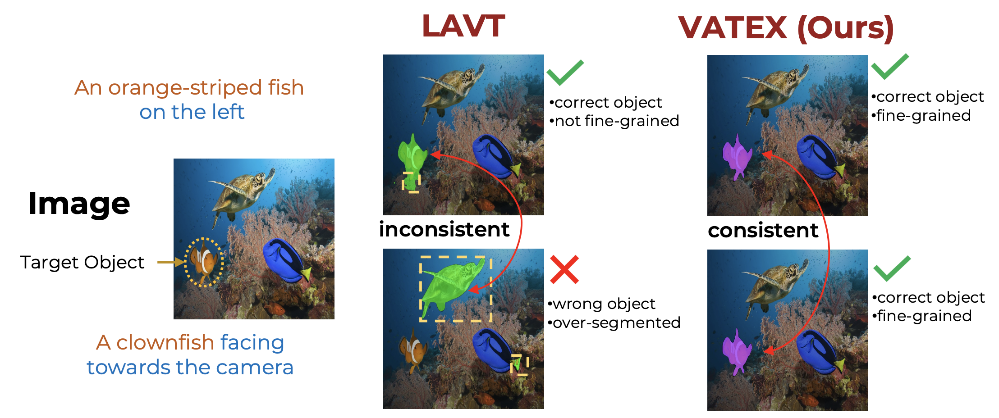
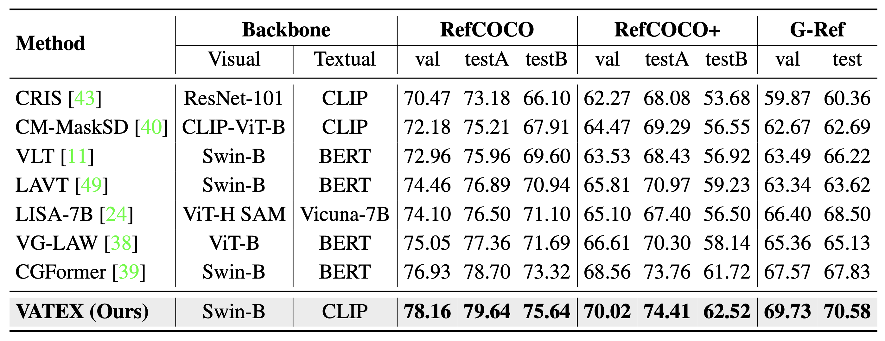

<div align="center">
<h1>
<b>
Vision-Aware Text Features in Referring Image Segmentation: From Object Understanding to Context Understanding
</b>
</h1>
</div>

<p align="center">
  <a href="https://openaccess.thecvf.com/content/WACV2025/html/Nguyen-Truong_Vision-Aware_Text_Features_in_Referring_Image_Segmentation_From_Object_Understanding_WACV_2025_paper.html">
    
  </a>
  <a href="https://arxiv.org/abs/2404.08590">
    
  </a>
  <a href="https://vatex.hkustvgd.com/">
    
  </a>
</p>


<section class="hero teaser">
  <div class="container is-max-desktop">
    <div class="hero-body">
      
        <br>
        <strong style="color: orange;font-size: 1.2em">TL;DR:</strong>
        <i><span style="font-size: 1.0em; font-weight: bold">VATEX</span> is a novel method for referring image segmentation that leverages vision-aware text features to improve text understanding. By decomposing language cues into object and context understanding, the model can better localize objects and interpret complex sentences, leading to significant performance gains.
        </i>
      </h3>
    </div>
  </div>
</section>

---

## 🏆 State-of-the-Art Performance

VATEX achieves state-of-the-art performance on multiple referring image segmentation benchmarks, demonstrating significant improvements over previous methods without requiring any external training data.

<div align="left">


### 🎯 RefCOCO
[](https://paperswithcode.com/sota/referring-expression-segmentation-on-refcoco?p=improving-referring-image-segmentation-using)
[](https://paperswithcode.com/sota/referring-expression-segmentation-on-refcoco-8?p=improving-referring-image-segmentation-using)
[](https://paperswithcode.com/sota/referring-expression-segmentation-on-refcoco-9?p=improving-referring-image-segmentation-using)

### 🎯 RefCOCO+
[](https://paperswithcode.com/sota/referring-expression-segmentation-on-refcoco-3?p=improving-referring-image-segmentation-using)
[](https://paperswithcode.com/sota/referring-expression-segmentation-on-refcoco-4?p=improving-referring-image-segmentation-using)
[](https://paperswithcode.com/sota/referring-expression-segmentation-on-refcoco-5?p=improving-referring-image-segmentation-using)


### 🎯 G-Ref
[](https://paperswithcode.com/sota/referring-expression-segmentation-on-refcocog?p=improving-referring-image-segmentation-using)


### 🎯 Additional Benchmarks
[](https://paperswithcode.com/sota/referring-video-object-segmentation-on-refer?p=improving-referring-image-segmentation-using)
[](https://paperswithcode.com/sota/referring-expression-segmentation-on-davis?p=improving-referring-image-segmentation-using)

</div>

---

## 🛠️ **Requirements & Setup**

### 🖥️ **System Requirements**
- CUDA 11.1
- Python 3.8 
- PyTorch 1.9.0

### 📥 **Installation**
For detailed setup instructions, refer to [installation.md](docs/installation.md).

### 🗂️ **Data Preparation**
Follow the steps outlined in [data.md](docs/data.md) to prepare the datasets.

### 🚀 **Getting Started**
1. **Download Pretrained ImageNet Models:**
   - Swin-B
   - Swin-L  
   - Video-Swin-B
2. Place models in the `weights` folder.

---
## 🏋️‍♂️ **Training**

To train VATEX using `train_net_video.py`, first set up the corresponding datasets as described in [data.md](docs/data.md), then execute:

```bash
python train_net_video.py --config-file <config-path> --num-gpus <?> OUTPUT_DIR <?>
```

Where OUTPUT_DIR is the directory where the weights and logs will be stored.
For example, train VATEX with Swin-B backbone with 2 GPU as 
```bash
python train_net_video.py --config configs/refcoco/swin/swin_base.yaml --num-gpus 2 OUTPUT_DIR results/swin_base
```
To resume training, simply add the flag `--resume`.

## 📈 **Evaluation**
To evaluate a trained model, use the following command:
```
python train_net_video.py --config configs/refcoco/swin/swin_base.yaml --num-gpus 2 --eval-only OUTPUT_DIR ${OUTPUT_DIR} $ MODEL.WEIGHTS link_to_weights
```


<section class="section">
  <div class="container is-max-desktop">
    <div class="columns is-centered has-text-centered">
      <div class="column is-four-fifths">
        <h2 class="title is-3">📊 Main Results</h2>
        <div class="content has-text-justified">
          
          <p>
            <br>
            As shown in the table, our method achieves <span style="font-style: italic; font-weight: 600;">remarkable performance improvements</span> over state-of-the-art methods across all benchmarks on mIoU metrics. Notably, we surpass recent methods like <b>CGFormer</b> and <b>VG-LAW</b> by <span style="font-style: italic; font-weight: 600;">substantial margins</span>: <span style="color: #2ea44f; text-shadow: 1px 1px 3px rgba(46,164,79,0.3);">+1.23%</span> and <span style="color: #2ea44f; text-shadow: 1px 1px 3px rgba(46,164,79,0.3);">+3.11%</span> on <b>RefCOCO</b>, <span style="color: #2ea44f; text-shadow: 1px 1px 3px rgba(46,164,79,0.3);">+1.46%</span> and <span style="color: #2ea44f; text-shadow: 1px 1px 3px rgba(46,164,79,0.3);">+3.31%</span> on <b>RefCOCO+</b>, and <span style="color: #2ea44f; text-shadow: 1px 1px 3px rgba(46,164,79,0.3);">+2.16%</span> and <span style="color: #2ea44f; text-shadow: 1px 1px 3px rgba(46,164,79,0.3);">+4.37%</span> on <b>G-Ref</b> validation splits respectively. The more complex the expressions, the greater the performance gains achieved by VATEX. Even compared to LISA, a large pre-trained vision-language model, VATEX consistently achieves an <span style="font-style: italic; font-weight: 600;">impressive</span> <span style="color: #2ea44f; text-shadow: 1px 1px 3px rgba(46,164,79,0.3);">3-5%</span> better performance across all datasets.
          </p>
        </div>
      </div>
    </div>

  </div>
</section>

## 📚 Citing VATEX
If you find VATEX useful for your research, please cite the following paper:
```
@inproceedings{nguyen2025visionaware,
  title={Vision-Aware Text Features in Referring Image Segmentation: From Object Understanding to Context Understanding},
  author={Nguyen, Truong and Others},
  booktitle={Proceedings of the IEEE/CVF Winter Conference on Applications of Computer Vision (WACV)},
  year={2025},
  url={https://openaccess.thecvf.com/content/WACV2025/html/Nguyen-Truong_Vision-Aware_Text_Features_in_Referring_Image_Segmentation_From_Object_Understanding_WACV_2025_paper.html}
}
```